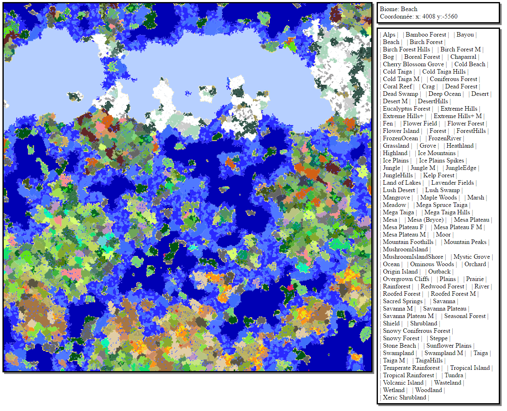

# BiomeAtlas

A Forge mod for 1.10.2 that generates a map of biomes via command or on startup.
To easily find the perfect spot the map is interactive. Same biome type is highlighted when overring it.

* Supports mod-added biomes.
* Great for finding that perfect seed.



## Compiling

    ./gradlew clean build

## Usage

    /biomeatlas <apothem> [<resolution>]
    
Apothem is the "radius" of a square around you in blocks.

Resolution is an optional parameter that lets you generate larger areas in shorter amounts of time by skipping 1 in X blocks. Specifically, it is the number of distinct blocks represented per pixel in one dimension. The default value is 16 (a chunk), which means that each 16 blocks (one chunk) gets its own pixel in the map. A value of 1 will represent one block per pixel. Higher values allow you to map larger areas without increasing the amount of time it takes to generate the map.

### Generate on Start

Or instead, you can have map generation be initiated when a server is started with:

	-DbiomeAtlas.mapOnStartup=true

Such as:

	java -Xmx5G -DbiomeAtlas.mapOnStartup=true -jar forge.jar

You can also define the following properties:

	-DbiomeAtlas.apothem=250
	-DbiomeAtlas.mapDimension=0
	-DbiomeAtlas.centerX=0
	-DbiomeAtlas.centerZ=0
	-DbiomeAtlas.resolution=16
	-DbiomeAtlas.exitOnFinish=false

### Finding a Seed

To find an ideal seed, you can make a Batch script or a shell script to continually restart a server with a new seed and have BiomeAtlas generate a map each time.

Linux:

```sh
for i in `seq 1 50`;
do
	rm -Rf world
	java -Xmx5G -DbiomeAtlas.mapOnStartup=true -DbiomeAtlas.exitOnFinish=true -jar forge.jar nogui
done
```

Windows:

```batch
@echo off
for /l %%x in (1, 1, 50) do (
   rmdir /s /q world
   java -Xmx5G -DbiomeAtlas.mapOnStartup=true -DbiomeAtlas.exitOnFinish=true -jar forge.jar nogui
)
pause
```

You should find a bunch of **biomeatlas_<seed>.html** files in the same directory.

## License

MIT License.
